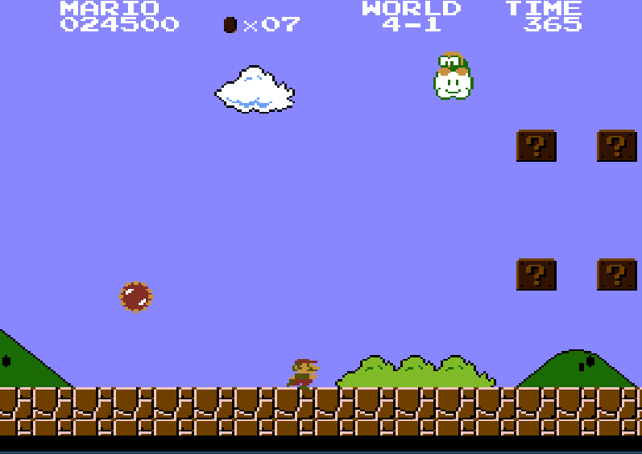

# NES emulator



Yep, another one.

This is just a hobby project I did for educational purposes. It can play mapper {0,1,2,3,4,7} games and most games I've
tested so far seem to work.

# Build instructions

`cargo build --release`

NOTE: The emulator depends on SDL2.

# Usage instructions

```
Usage: nes [options] <filename>

    Positional Arguments:
    filename          nes ROM to load

    Options:
    -d, --debug       open debugger
    --help            display usage information
```

Controls:  
DPad/Left analog stick = NES DPad  
XBox A / PS Cross = NES A  
XBox B / PS Circle = NES B  
Start = NES Start  
Select = NES Select  
F = Advance one frame  
M = Mute emulator  
P = Pause emulation  
R = Reset NES  
1-9 = Select save state slot *n*  
F5 = Save save state to selected slot  
F7 = Load save state from selected slot

Up to 9 save states are supported, which are saved to a file with the same name as the rom but with extension `.stat.`.
For cartridges that have battery-backed RAM, the data will be saved to a file with extension `.sav`.

NOTE: The emulator requires a controller to play.

# Compatibility

Games that have been partially tested:

- Arkanoid
- Battletoads
- Bomberman
- Castlevania
- Contra
- Donkey Kong
- Double Dribble
- Earthbound
- Final Fantasy I & III
- Galaga
- Ice Climber
- Kirby's Adventure
- Kung Fu
- Mega Man I, II, III, IV, V
- Metal Gear
- Metroid
- Ninja Gaiden I, II & III
- Pac-Man
- Q-bert
- Rad Racer
- Silver Surfer
- Snake's Revenge
- Super Mario Bros.
- Super Mario Bros. 2
- Super Mario Bros. 3
- Tetris
- Time Lord
- Wario's Woods
- Zelda I & II

I don't recommend actually using the emulator. Besides not being fully accurate, the number of playable games is not
great due to not many mappers being implemented and the user interface leaves much to be desired.

# Acknowledgements

Special thanks to the EmuDev discord server and all the wonderful people there that have helped me while writing this
emulator. I wouldn't have been able to do it on my own.